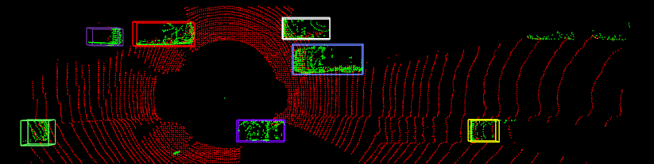

Introduction
====

This is a demo of point cloud clustering and tracking.

Dependencies
====
This code has been tested on python 3.7

One can either use the system python or create a virtual enviroment (python3). To install required dependencies on the system python, please run the following command at the root of this code:
```
$ pip install -r requirements.txt
```
Dataset
====
The lidar data format is could see in the folder data.
```
PC_Tracking
├── data
│   ├── predictions
```
Visualization
====
```
$ python main.py predictions
```
Acknowledgement
====
Part of the code is borrowed from (https://github.com/jiemingcui/Deecamp_AB3DMOT)

Result
===
For the complete tracking trajectory, please run main.py to show the demo.


